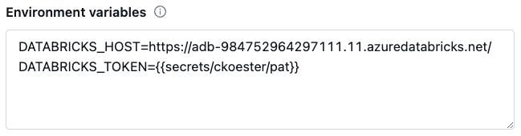

# Databricks SQL Query Logger

Retrieves DBSQL [query history](https://docs.databricks.com/api/workspace/queryhistory/list) and merges it into a Delta Lake table.

A [System Table](https://docs.databricks.com/en/administration-guide/system-tables/index.html) containing similar data is on the Databricks roadmap, so solutions like this will be mostly unecessary in the near future.

## Features
- Ingests DBSQL query history based on supplied parameters
- Supports incremental ingestion
- Works in triggered or continuous mode:
    - `triggered` - ingests data and exits
    - `continuous` - ingests data every N seconds until cancelled

## Getting Started

### Dependencies

* [Deletion Vectors](https://docs.databricks.com/en/delta/deletion-vectors.html) (DBR 14.3 LTS and above) and [Liquid Clustering](https://docs.databricks.com/en/delta/clustering.html) (DBR 3.3 LTS and above). If you need to support an earlier DBR, update the `create_target_table` function accordingly.
* The Python whl includes the [Databricks SDK](https://docs.databricks.com/en/dev-tools/sdk-python.html) 0.25.1. If you use the module directly, be sure to test any other versions prior to use.

### Deploy as Databricks Asset Bundle (DAB)
This option deploys a Job that runs the DBSQL Query Logger as a Python wheel task. Parameters are set in the job.

1. Install the Databricks CLI from https://docs.databricks.com/dev-tools/cli/databricks-cli.html

2. Authenticate to your Databricks workspace, if you have not done so already:
    ```
    $ databricks configure
    ```

3. To deploy a development copy of this project, type:
    ```
    $ databricks bundle deploy --target dev
    ```
    (Note that "dev" is the default target, so the `--target` parameter
    is optional here.)

    This deploys everything that's defined for this project.
    For example, the default template would deploy a job called
    `[dev yourname] dbsql_query_logger` to your workspace.
    You can find that job by opening your workpace and clicking on **Workflows**.

4. Similarly, to deploy a production copy, type:
   ```
   $ databricks bundle deploy --target prod
   ```

   Note that the default job from the template has a schedule that runs every day
   (defined in resources/dbsql_query_logger_job.yml). The schedule
   is paused when deploying in development mode (see
   https://docs.databricks.com/dev-tools/bundles/deployment-modes.html).

5. To run a job or pipeline, use the "run" command:
   ```
   $ databricks bundle run
   ```

6. Optionally, install developer tools such as the Databricks extension for Visual Studio Code from
   https://docs.databricks.com/dev-tools/vscode-ext.html. Or read the "getting started" documentation for
   **Databricks Connect** for instructions on running the included Python code from a different IDE.

7. For documentation on the Databricks asset bundles format used
   for this project, and for CI/CD configuration, see
   https://docs.databricks.com/dev-tools/bundles/index.html.

### Install Python whl
This option allows for running the DBSQL Query Logger in a notebook, which can be useful for benchmarks and other scenarios.

- Download the python whl file from the latest [release](https://github.com/chris-koester-db/dbsql_query_logger/releases). It is not published to PyPi.
- Upload the whl file as a workspace file or to a Unity Catalog volume
- Option 1: Install as cluster-scoped library
    - Go to the **Libraries** menu of your cluster
    - Select **Install new** and navigate to where you saved the whl
- Option 2: Install as notebook-scoped library
    - Run the following in a notebook cell: `%pip install /path/to/my_package.whl`

See the [libraries](https://docs.databricks.com/en/libraries/index.html) documentation for full details and additional options.

### Usage

The code below shows how to run the DBSQL Query Logger. Refer to docstrings for more details.

The [src](https://github.com/chris-koester-db/dbsql_query_logger/tree/main/src) folder includes a notebook that uses widgets for easy parameterization.

```python
import logging
from dbsql_query_logger import QueryLogger

logging.basicConfig(
    format="%(asctime)s %(message)s",
    datefmt="%Y-%m-%dT%H:%M:%S%z"
)

logger = logging.getLogger('dbsql_query_logger')
logger.setLevel(logging.INFO)

query_logger = QueryLogger(
    catalog = 'chris_koester',
    schema = 'observe',
    table = 'query_history',
    pipeline_mode = 'triggered',
    backfill_period = '24 hours',
    reset = 'no'
)

query_logger.run()
```

### Authentication
[Authentication](https://docs.databricks.com/en/dev-tools/sdk-python.html#authenticate-the-databricks-sdk-for-python-with-your-databricks-account-or-workspace) is handled by the Databricks SDK, which implements the Databricks client unified authentication standard. Examples include:
- [Notebook](https://docs.databricks.com/en/dev-tools/sdk-python.html#use-the-databricks-sdk-for-python-from-a-databricks-notebook) - uses native notebook authentication. No configuration necessary.
- [Environment variables](https://docs.databricks.com/en/dev-tools/auth/index.html#environment-variables-and-fields-for-client-unified-authentication) - environment variable can be set as part of the cluster configuration for scheduled jobs.

